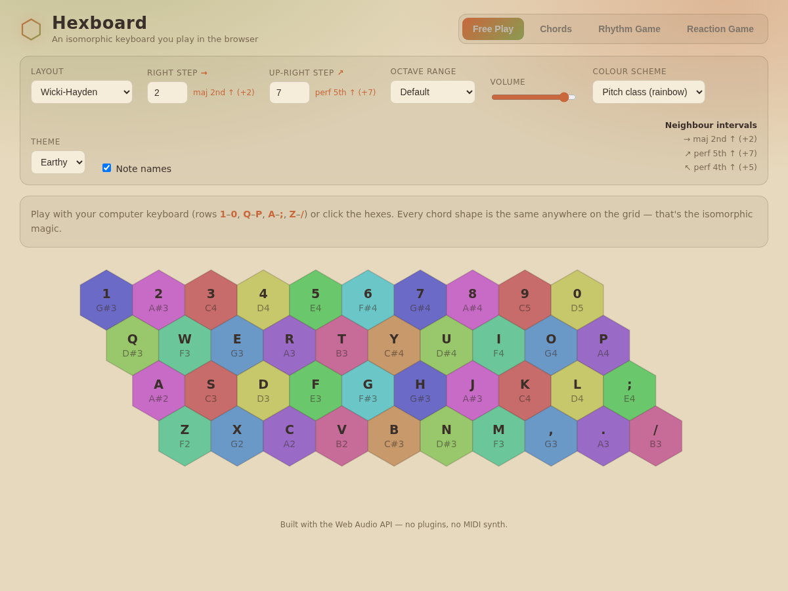
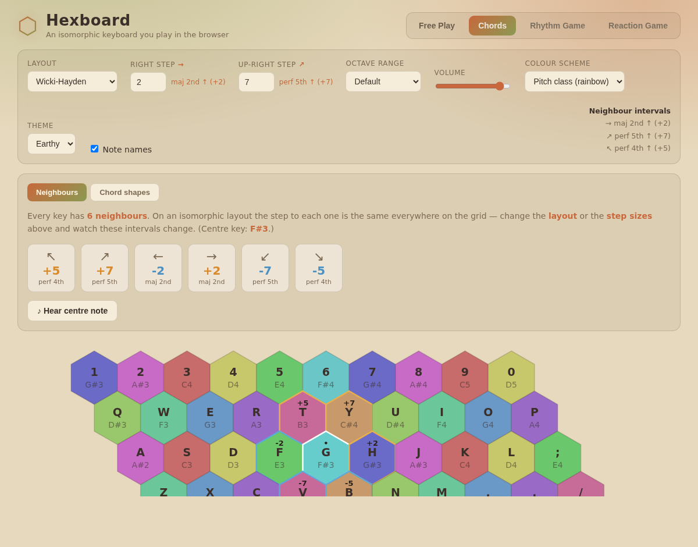

# Hexboard — an isomorphic keyboard in the browser

A hexagonal [isomorphic keyboard](https://en.wikipedia.org/wiki/Isomorphic_keyboard)
you play with your computer keyboard (or mouse/touch). On an isomorphic layout a
chord *shape* is the same everywhere on the grid — so once you learn one voicing,
you know it in every key.

Sound uses the **Web Audio API** — no MIDI synth, no plugins, nothing to install.
The piano is a real recorded grand (Salamander samples, pitch-shifted per note),
with a Karplus-Strong physical-model fallback while the samples decode / if they
fail to load.



## Run it

Just open `index.html` in a browser. That's it — it's a static site.

```
xdg-open index.html      # Linux
open index.html          # macOS
```

(Optional) serve it locally if you prefer a real URL:

```
python3 -m http.server
# then visit http://localhost:8000
```

## Deploy (free)

It's fully static, so any static host works:

- **GitHub Pages** — push to a repo, enable Pages on the `master` branch (root).
  Your site appears at `https://<user>.github.io/<repo>/`.
- **Netlify / Cloudflare Pages / Vercel** — drag-and-drop the folder, or connect
  the repo. No build step, no config.

## How to play

- **Keys:** rows `1`–`0`, `Q`–`P`, `A`–`;`, `Z`–`/` map to the four hex rows.
- **Layout:** pick a preset, or set the two step sizes yourself:
  - **Right step** — semitones between left/right neighbours (→)
  - **Up-right step** — semitones between a key and its up-right neighbour (↗)

  Those two intervals define the *entire* lattice — the up-left interval is just
  `up-right − right`. This is the "control over left-right / up-down step size"
  the instrument is built around. The grid is staggered like a physical QWERTY
  (each row down shifts right, so `A` sits up-left of `Z`).
- **Colour scheme:** Pitch class (rainbow), Octave bands, Monochrome, and a
  "Scale · …" entry for each scale — major, natural minor, major/minor pentatonic,
  blues, dorian, mixolydian, whole-tone, chromatic. Picking a scale reveals a
  **scale root** selector; in-scale notes light up, the rest fade.
- **Theme:** *Earthy* (warm, default) or *Neon* (dark).
- **Octave / Volume / Note names** — self-explanatory.

### Chords — a layout tutorial

An interactive explainer for whatever layout you've dialled in, with two views:

- **Neighbours** — every key has **6 neighbours**; this shows the signed interval
  to each (→ +2, ↗ +7, ↖ +5, …). Change the layout or the step sizes and watch
  them update — that's the isomorphic idea made concrete.
- **Chord shapes** — pick a root, chord type and inversion to see the chord's
  fixed **shape** on the grid, with `R / 3 / 5 / 7` role badges. The same shape
  plays the same chord anywhere you slide it.



### Games

- **Rhythm Game** — notes scroll toward the hit-line; press the matching key on
  time. Scored by timing accuracy (Perfect / Great / Good / Miss) with a combo
  multiplier. A few simple built-in songs (Twinkle Twinkle, Ode to Joy, …).
- **Reaction Game** — play the called chord + inversion as fast as you can, with
  two cue modes:
  - **Visual** — the chord is named (e.g. "F Major, 1st inversion").
  - **Audio** — you *hear* the chord and must reproduce it (ear training). Use
    **Replay** to hear it again; the answer is revealed once you nail it.

  Tracks best & average reaction time. Toggle "Show target keys" off for a real
  challenge.

Tip: you can deep-link a mode, e.g. `index.html#tutorial` or `index.html#reaction`.

## Project layout

```
index.html          # page shell
css/styles.css      # neon dark theme
js/
  theory.js         # isomorphic-grid math, note names, chords/inversions, scales
  audio.js          # sampled piano + Karplus-Strong fallback (Web Audio)
  piano-samples.js  # Salamander Grand Piano samples, base64 (loads from file://)
  keyboard.js       # hex-grid render (Canvas) + keyboard/mouse/touch input
  songs.js          # simple melodies for the rhythm game
  games.js          # RhythmGame + ReactionGame (visual/audio cues)
  tutorial.js       # LayoutTutorial — neighbour intervals + chord shapes
  main.js           # DOM wiring (controls, modes, scoreboards)
archive/            # the original Python/tkinter prototype (reference only)
```

The code uses plain `<script>` tags and a single `window.KB` namespace so it runs
straight from `file://` with no bundler or server.

## Ideas / next steps

- Play the melody as backing audio in the rhythm game (currently you generate the
  sound yourself).
- Load arbitrary songs from MIDI files.
- Sustain pedal, velocity from key-hold, multi-velocity samples.
- Persist high scores (would need a small backend).

## Credits

Piano samples: **Salamander Grand Piano** by Alexander Holm, licensed
[CC-BY 3.0](https://creativecommons.org/licenses/by/3.0/) (via the Tone.js sample
set). Sampled every minor third from A0–C8 and pitch-shifted between points.

## Background

Inspired by *Isomorphic Tessellations for Musical Keyboards*
([ResearchGate](https://www.researchgate.net/publication/233783923_Isomorphic_Tessellations_for_Musical_Keyboards)).
